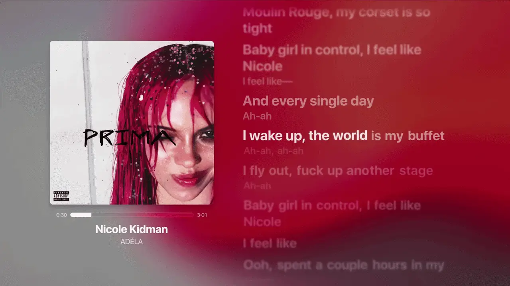

# Spicy Lyrics
[](https://github.com/spikerko/spicy-lyrics/) [](https://github.com/spikerko/spicy-lyrics/) [](https://discord.com/invite/uqgXU5wh8j)

### *[oursitee](https://yoursit.ee/lyrics)*

Spicy Lyrics replaces Spotify's lyrics view with animated lyrics, dynamic backgrounds, romanization, and customization options. It is an open-source extension for the Spotify desktop client, built on [Spicetify](https://spicetify.app).



**Links:** [Guides](https://guides.spicylyrics.org/s/guides) · [FAQ](https://guides.spicylyrics.org/s/tools/doc/faq-anGSiKrnmX) · [Status](https://status.spicylyrics.org/) · [Discord](https://discord.gg/lyrc) · [Developers Platform](https://developers.spicylyrics.org)

## Installation

Spicy Lyrics runs only in the Spotify **desktop** client, through Spicetify. It does not need Spotify Premium.

### 1. Install Spicetify

**Windows** (PowerShell):

```powershell
iwr -useb https://raw.githubusercontent.com/spicetify/cli/main/install.ps1 | iex
```

**macOS / Linux** (Terminal):

```bash
curl -fsSL https://raw.githubusercontent.com/spicetify/cli/main/install.sh | sh
```

> [!WARNING]
> Spicetify cannot modify a Snap-based Spotify installation on Linux. See the [official Spicetify guide](https://spicetify.app/docs/getting-started) for other setups.

### 2. Check that the Marketplace is installed

Look for the **Marketplace** button in Spotify's top-left corner. If it's missing, install it:

**Windows:**

```powershell
iwr -useb https://raw.githubusercontent.com/spicetify/marketplace/main/resources/install.ps1 | iex
```

**macOS / Linux:**

```bash
curl -fsSL https://raw.githubusercontent.com/spicetify/marketplace/main/resources/install.sh | sh
```

### 3. Install Spicy Lyrics

1. Open the **Marketplace**.
2. Go to **Extensions** and search for **Spicy Lyrics**.
3. Select **Install**.

Play a song and open the lyrics view to confirm it loaded. Marketplace installs update automatically; restart Spotify if a new version hasn't appeared.

<details>
<summary><strong>Manual installation (not recommended)</strong></summary>

1. Download [`spicy-lyrics.mjs`](./builds/spicy-lyrics.mjs).
2. Put it in your Spicetify Extensions folder. [Find the folder for your OS](https://spicetify.app/docs/customization/extensions#manual-installation).
3. Run:

```bash
spicetify config extensions spicy-lyrics.mjs
spicetify apply
```

Manual installs don't update automatically.

</details>

## Troubleshooting

If Spicy Lyrics disappears after a Spotify update or fails to load, try these in order:

```bash
spicetify apply
spicetify backup apply
spicetify update
spicetify restore backup apply
```

**Lyrics missing, outdated, or wrong?**

1. Make sure you opened the song version you meant to. Singles, albums, deluxe, clean, and remastered releases can have different lyrics or timing.
2. Try another release of the same recording.
3. Clear the lyrics cache in Spicy Lyrics' settings, then reopen the song.
4. Check the [status page](https://status.spicylyrics.org/).
5. Search [#lyric-issues](https://discord.com/channels/1369992682214264993/1370023661830148106) on Discord, then report it with the exact Spotify link.

**High CPU or memory use?** Animated lyrics, dynamic backgrounds, themes, custom CSS, and other extensions all add load. Restart Spotify, test without other extensions or snippets, and check Spotify's hardware-acceleration setting.

### Reporting a bug

Search [#extension-bugs](https://discord.com/channels/1369992682214264993/1370023518313644193) first. If it's new, include:

- your operating system
- Spotify, Spicetify, and Spicy Lyrics versions
- exact steps to reproduce
- what you expected and what happened instead
- the affected song link, if relevant
- screenshots, video, or console errors

> [!CAUTION]
> Never share account tokens, cookies, authorization headers, or other secrets in a bug report.

Security issues go through [SECURITY.md](./SECURITY.md), not public channels.

## FAQ

<details>
<summary><strong>What types of lyrics are supported?</strong></summary>

| Type | What it does |
|------|--------------|
| Word-synced | Highlights individual words, or timed parts of words, as they're sung. |
| Line-synced | Advances one timed line at a time. |
| Static | Shows lyrics without timing. |

The sync type depends on the lyric data available for that exact track. There's no setting to turn line-synced lyrics into word-synced ones.

</details>

<details>
<summary><strong>Where do the lyrics come from?</strong></summary>

Community-uploaded TTML lyrics first, then other supported sources, including Apple Music and Spotify. What you see depends on availability, matching, and source priority.

</details>

<details>
<summary><strong>Can I use it on mobile?</strong></summary>

No. The extension runs in Spotify's desktop client only.

[Spicy Player](https://github.com/thex24/Spicy-Player/) is a separate offline Android music player by TX24 that ports the Spicy Lyrics experience. It is not a Spotify mobile extension.

</details>

<details>
<summary><strong>Can I use it offline?</strong></summary>

Online lyric lookup needs an internet connection. Lyrics you import into the **Lyrics Manager's** persistent local library stay on your device until you remove them.

</details>

<details>
<summary><strong>Can I use my own TTML file without uploading it?</strong></summary>

Yes. Open the **Lyrics Manager** and import the TTML as a temporary upload (for quick testing) or a persistent one (kept in your local library). There's no setting for adding other online lyric providers.

</details>

<details>
<summary><strong>Why is the timing off in Spotify?</strong></summary>

If one song is off, the lyric file may have been timed against a different release. Report it with the song link.

If every song is off on your device, use the playback-offset setting in Spicy Lyrics.

</details>

<details>
<summary><strong>Can I change the lyrics font?</strong></summary>

Install the font on your computer, then:

1. Open **Marketplace → Snippets → Add CSS**.
2. Paste this, replacing `Your Font Name` with the font's exact name:

   ```css
   * {
     font-family: "Your Font Name" !important;
   }
   ```

3. Name and save the snippet.
4. In Spicy Lyrics settings, enable **Use System Font** under **Appearance**.

This changes Spotify's whole interface font, not only the lyrics. Disable the snippet if characters go missing or layouts break.

</details>

<details>
<summary><strong>Where can I request a feature?</strong></summary>

Search [#extension-suggestions](https://discord.com/channels/1369992682214264993/1370023393675575369) first, then post if your idea isn't already there. Describe the problem and who it affects, not only the solution you want.

</details>

More answers are in the [full FAQ](https://guides.spicylyrics.org/s/tools/doc/faq-anGSiKrnmX).

## Contributing lyrics

Most word-synced lyrics in Spicy Lyrics are TTML files made by the community. TTML is an XML-based format that can store line and word timing, background vocals, duet positioning, and romanization, which LRC can't do consistently.

To make one, start with the [TTML Guide](https://guides.spicylyrics.org/s/ttml):

1. [Import the song](https://guides.spicylyrics.org/s/ttml/doc/1-import-the-song-iHfycCuOSU)
2. [Import the lyrics](https://guides.spicylyrics.org/s/ttml/doc/2-import-the-lyrics-CK0YxRxPwp)
3. [Check the lyrics](https://guides.spicylyrics.org/s/ttml/doc/3-check-the-lyrics-ZHDMonddCz)
4. [Sync the lyrics](https://guides.spicylyrics.org/s/ttml/doc/4-sync-the-lyrics-MJsQ3M0dIS)
5. [Add the songwriters](https://guides.spicylyrics.org/s/ttml/doc/5-add-the-songwriters-cP7OWZhyKd)
6. [Export and test the TTML](https://guides.spicylyrics.org/s/ttml/doc/6-export-and-test-the-ttml-nzae0Py9JJ)
7. [Submit your first TTML](https://guides.spicylyrics.org/s/ttml/doc/submit-your-first-ttml-sX53doCeNh)

Line-synced TTML is fully valid. If it's your first file, start with whole-word timing and learn syllable splitting later.

| Guide | Covers |
|-------|--------|
| [Transcription Guide](https://guides.spicylyrics.org/s/transcription) | Spelling, capitalization, punctuation, ad-libs, censored lyrics, repeats, and romanization |
| [Splitting Guide](https://guides.spicylyrics.org/s/splitting) | Splitting words into timed syllables, and which splits are accepted |
| [Uploading and TTML Rules](https://guides.spicylyrics.org/s/tools/doc/uploading-and-ttml-rules-rvofBBi0PV) | What an upload must meet to be approved |
| [Separating Vocals](https://guides.spicylyrics.org/s/tools/doc/separating-vocals-for-better-syncing-HYKpdByeMF) | Isolating vocals so words are easier to hear while syncing |
| [TTML Tool Feature Reference](https://guides.spicylyrics.org/s/tools/doc/ttml-tool-feature-reference-hx9XAG06L8) | Every feature of the TTML Tool |

The short version of the rules:

- **The recording is the source of truth.** Check copied lyrics against the exact song version; even official lyrics can be wrong.
- **No AI transcription or AI timing.** AI vocal separation is fine as a listening aid, and so is the TTML Tool's built-in automation, as long as you check its output.
- **No filler.** Don't add `[Instrumental]`, section headings, ellipses, or placeholders. Spicy Lyrics draws interludes itself.
- **One timing mode per file.** Line-synced or word-synced, never both.
- **One file per distinct version.** Different audio, censorship, intros, or timing need separate TTMLs.
- **No unreleased songs.** Wait until the song is playable on Spotify in at least one timezone.
- **Clear the lyrics cache after every upload**, then verify the result against the streamed song.

## Development

Requires [Bun](https://bun.sh) and a working Spicetify install.

```bash
bun install
bun run dev
bun run build
bun run lint
bun run fmt
```

## Support the project

- Donate to Spikerko on [Ko-fi](https://ko-fi.com/spikerko)
- Contribute code to this repository
- Boost the [Discord server](https://discord.gg/lyrc)
- Report bugs you can reproduce
- Make accurate TTML lyrics

## License

The extension is licensed under [AGPL-3.0](./LICENSE). The hosted services, databases, and websites behind Spicy Lyrics are separate and aren't covered by this license.

*Inspired by [Beautiful Lyrics](https://github.com/surfbryce/beautiful-lyrics)*
